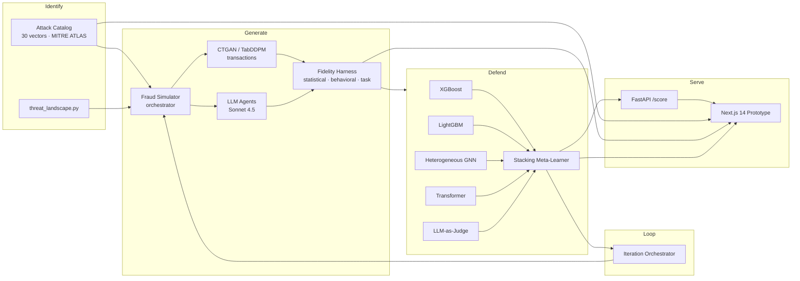

# 🛡️ PaySentinel

**Agentic Red-Team Lab for GenAI-Powered Payment Fraud.**

Identify novel fraud attacks → generate realistic simulations → defend with an ensemble detector — all in one closed loop.

---

## Why PaySentinel

Generative AI has lowered the barrier to sophisticated payment fraud: voice cloning of CFOs, deepfake video calls, AI-personalized spear phishing, synthetic identities stitched from real and fabricated data, rogue shopping agents. Static, rules-based defenses can't keep pace.

PaySentinel takes the opposite stance: **build the attack, then build the defense, then loop.**

| Pillar | Question it answers | Output |
|---|---|---|
| **Identify** | What novel GenAI fraud attacks exist, and what should we defend against? | A catalog of **30** distinct attack vectors, each mapped to **MITRE ATLAS** with a real-world case, IOCs, and suggested defenses |
| **Generate** | Can we simulate those attacks at scale with high fidelity? | Multi-model synthesis (CTGAN + TabDDPM) for transactions + LLM-agent generation for narrative attacks, validated on a 3-axis fidelity harness (statistical, behavioral, task-level) |
| **Defend** | Can we detect them in real time with high precision and low false positives? | A stacking ensemble of **XGBoost + LightGBM + heterogeneous GNN + Transformer sequence model + LLM-as-judge**, served by a FastAPI endpoint at <50 ms |
| **Closed Loop** | Does the defender get better as the attacker gets better? | A pipeline that runs N iterations: each round, defender failure cases seed the next round of attack ideas |

The strongest solutions treat these four as **one feedback loop**. So does PaySentinel.

---

## Architecture



---

## Repository layout

```
paysentinel/
├── identify/
│   ├── ATTACK_CATALOG.md          # Full 30-vector catalog with MITRE ATLAS mapping
│   ├── catalog.json              # Machine-readable version
│   └── threat_landscape.py       # CLI + API for the catalog
├── generate/
│   ├── base_data.py              # IEEE-CIS / PaySim loaders + sample profiles
│   ├── txn_generator.py          # CTGAN / TabDDPM training + sampling
│   ├── narrative_agents.py       # LLM agents for phishing, scam scripts, KYC, identities
│   ├── voice_sim.py              # Voice-script generation (no audio synth — text transcripts)
│   ├── fidelity_eval.py          # 3-axis fidelity scoring (KS / Wasserstein / behavioral / task)
│   └── pipeline.py               # End-to-end Generate pipeline
├── defend/
│   ├── feature_engineering.py    # 60+ behavioral + transactional features
│   ├── feature_lists/core.yaml
│   ├── train_xgb.py              # XGBoost
│   ├── train_lgb.py              # LightGBM
│   ├── train_gnn.py              # PyG heterogeneous GNN
│   ├── train_transformer.py      # Sequence Transformer
│   ├── llm_judge.py              # LLM-as-judge for narrative attacks
│   ├── ensemble.py               # Stacking meta-learner
│   ├── api.py                    # FastAPI /score service
│   └── evaluate.py               # Precision/Recall/F1/AUC + FP@volume
├── closed_loop/
│   └── pipeline.py               # Generate -> Defend -> failure-seeded re-Identify
├── webapp/                       # Next.js 14 prototype (6 pages, real-time)
├── configs/
│   └── demo.yaml
├── data/                         # Sample base data + synthetic outputs
├── results/                      # Metrics, plots, iteration history
├── docs/
│   └── Solution_Walkthrough.docx
└── tests/
```

---

## Quick start

```bash
git clone https://github.com/JustRK-07/paysentinel.git
cd paysentinel

# Install
python3 -m pip install -r requirements.txt

# Configure
cp .env.example .env
# (edit .env to set ANTHROPIC_API_KEY)

# Run the full demo pipeline (Identify → Generate → Defend → Loop, 3 iterations)
make demo

# Serve the detector
make run-api         # http://localhost:8000/docs

# Serve the web prototype
make run-web         # http://localhost:3000
```

---

## What's novel about this submission

1. **Closed-loop architecture** — the defender's failure cases become the seed corpus for the next round of attacks (RvB-style, [arXiv 2601.19726](https://arxiv.org/html/2601.19726v1)).
2. **3-axis fidelity harness** — statistical (KS / Wasserstein), behavioral (preserves fraud-specific patterns), task-level (does it train a good detector?). Addresses the gap noted in [Synthetic Tabular Generators Fail to Preserve Behavioral Fraud Patterns](https://arxiv.org/html/2604.13125v1).
3. **Multi-modal ensemble defense** — heterogeneous GNN + Transformer sequence + tabular boosting + LLM judge, stacked. Each catches a different failure mode.
4. **MITRE ATLAS-grounded taxonomy** — 30 attacks mapped to AML.T tactics. Auditable, extensible.
5. **Production-realistic serving** — FastAPI service with sub-50 ms scoring target, structured after real-time fraud decisioning industry standards (event-driven scoring, callback registration, account management).

---

## Evaluation criteria coverage

| Criterion (per PS) | How PaySentinel scores |
|---|---|
| **Diversity of attacks identified** | 30 vectors across 7 surfaces (voice, video, identity, social-eng, transaction, agentic commerce, supply chain) — see [`identify/ATTACK_CATALOG.md`](identify/ATTACK_CATALOG.md) |
| **Fidelity of attacks in simulation** | CTGAN + TabDDPM + LLM agents, validated on 3-axis harness with concrete metrics |
| **Detection algorithm efficacy** | 5-model stacking ensemble, evaluated on Precision / Recall / F1 / AUC / FP-rate @ volume |
| **Novelty** | Closed-loop red-team/blue-team, behavioral fidelity axis, MITRE ATLAS mapping |
| **Real-world feasibility** | Sub-50 ms scoring, FastAPI service, structured after real-time fraud decisioning standards |

---

## License

MIT — see [LICENSE](LICENSE).
