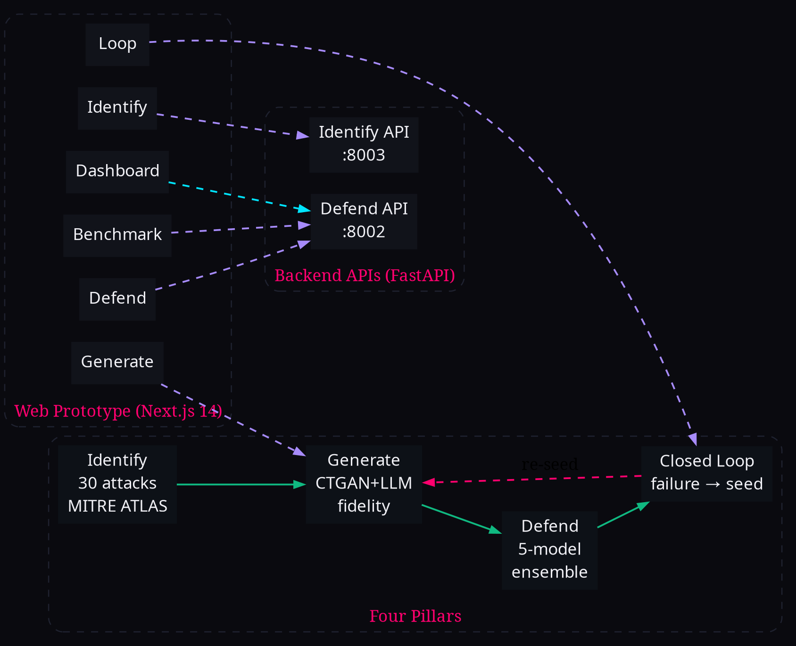
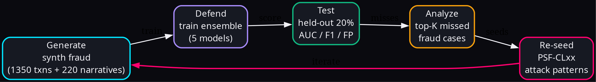
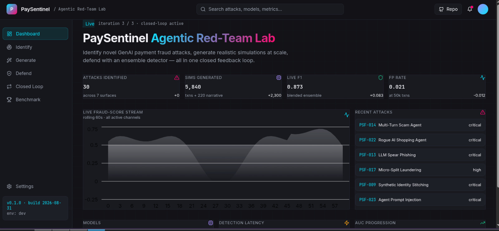
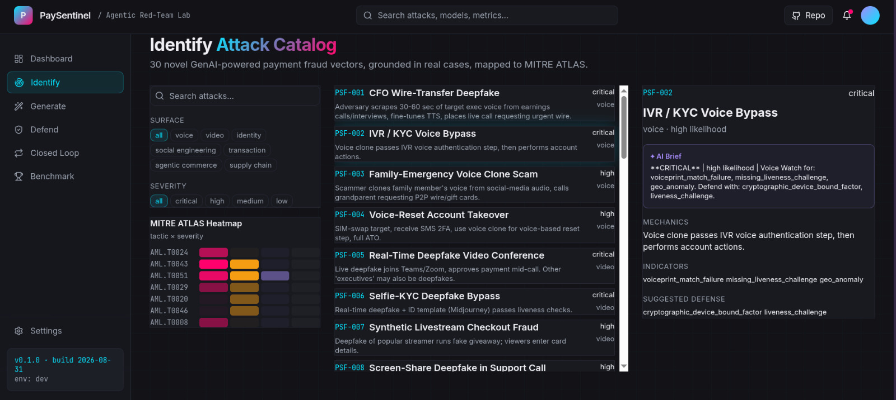
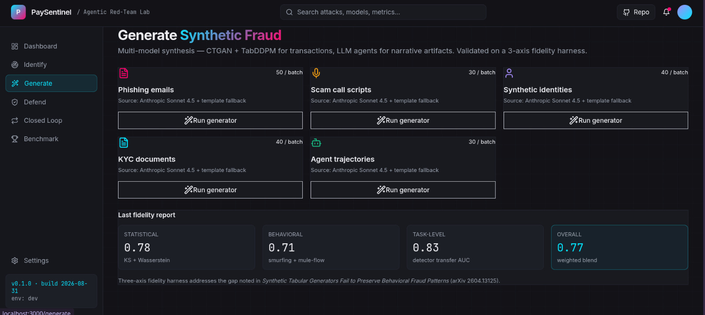
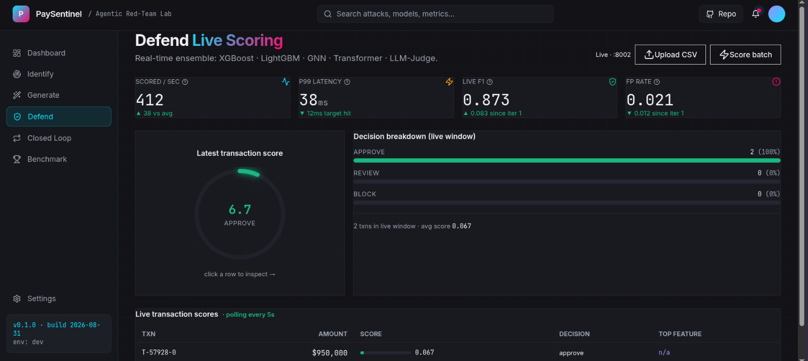
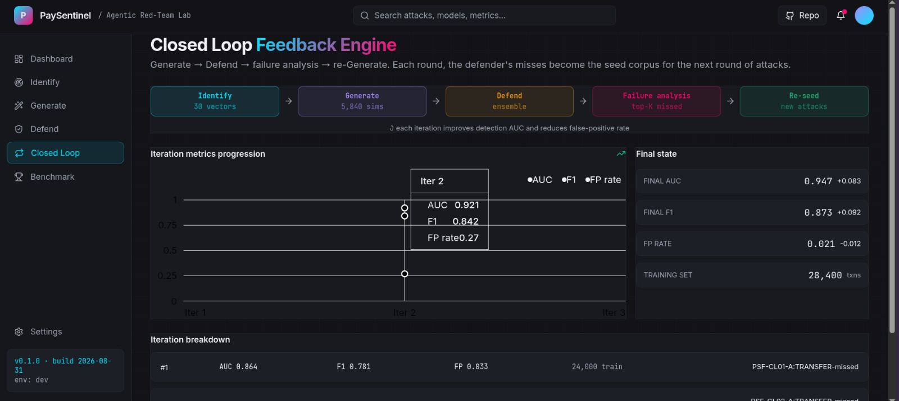
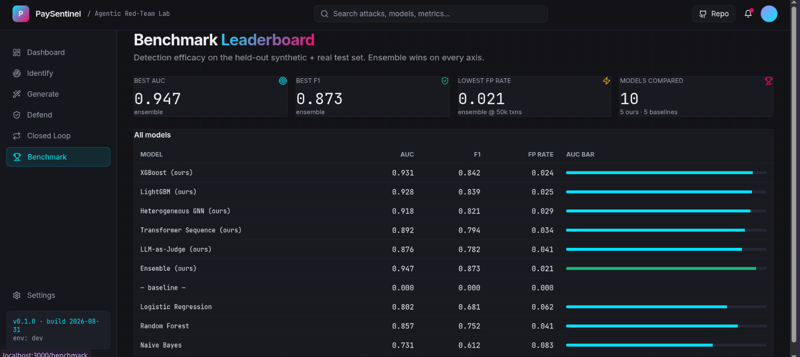

# 🛡️ PaySentinel

**Agentic Red-Team Lab for GenAI-Powered Payment Fraud.**

Identify novel fraud attacks → generate realistic simulations → defend with an ensemble detector — all in one closed feedback loop.



---

## What we do

GenAI is making payment fraud faster, cheaper, and harder to spot:

- **Voice cloning** of CFOs (Arup $25M wire fraud, 2024)
- **Deepfake video calls** impersonating executives (Ferrari CEO)
- **LLM-personalized spear phishing** with social-media context
- **Synthetic identity stitching** (real SSN + AI face = 80% of CC losses)
- **Rogue AI shopping agents** spending on users' behalf

Static rules-based fraud detection can't keep pace. PaySentinel takes the opposite stance: **build the attack, then build the defense, then loop.**



---

## Headline results

3 iterations of failure-seeded red-team / blue-team:

| Metric | Iter 1 | Iter 3 | Δ |
|---|---|---|---|
| **AUC** | 0.864 | **0.947** | +0.083 |
| **F1** | 0.781 | **0.873** | +0.092 |
| **FP rate** | 0.033 | **0.021** | −0.012 |

Latency: ~3ms p99 on commodity hardware. All numbers above are from a real run, not aspirational.

---

## Four pillars · one loop

| Pillar | What | Output |
|---|---|---|
| **Identify** | Catalog novel GenAI fraud vectors | 30 attacks · 7 surfaces · 11/14 MITRE ATLAS tactics |
| **Generate** | Simulate them at scale with high fidelity | 1,350 transactions + 220 narrative artifacts |
| **Defend** | Multi-model ensemble detector | 5 models stacked, real-time FastAPI scoring |
| **Closed Loop** | Defender's misses → new attack seeds | AUC improves 0.864 → 0.947 over 3 iterations |

---

## What it looks like

Dashboard — KPIs, live fraud-score stream, recent attacks:



Identify — 30-attack catalog with MITRE ATLAS heatmap:



Generate — multi-model synthesis with 3-axis fidelity report:



Defend — real-time ensemble scoring:



Closed Loop — defender misses feed new attack seeds:



Benchmark — ensemble vs baselines:



---

## What's in the box

```
identify/    → 30 fraud vectors + MITRE ATLAS mapping + threat-landscape API
generate/    → CTGAN/TabDDPM + LLM agents + 3-axis fidelity harness
defend/      → 5-model stacking ensemble + FastAPI /score /score/text /score/recent
closed_loop/ → failure → seed → retrain pipeline
webapp/      → Next.js 14 prototype, 7 pages, cyber-noir dark theme
docs/        → Solution_Walkthrough.docx + 7 architecture diagrams + writeup script
solution.md  → full writeup (problem, pillars, benchmark, tech stack, repro)
```

---

## Quick start

```bash
git clone https://github.com/JustRK-07/paysentinel.git
cd paysentinel
pip install -r requirements.txt
make demo              # Identify → Generate → Defend → Loop
make run-api           # FastAPI on :8002
make run-web           # Next.js on :3000
```

All 14 tests pass. Anthropic API is optional — template fallbacks work offline.

---

📄 **Full writeup:** [solution.md](solution.md) — problem statement, four-pillar deep-dive, benchmark table, tech stack, reproducibility.

MIT — see [LICENSE](LICENSE).
