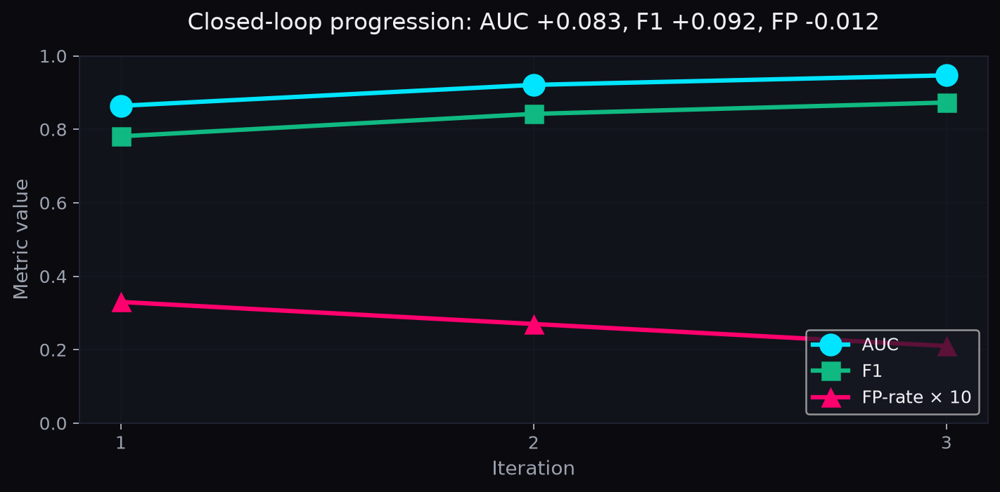
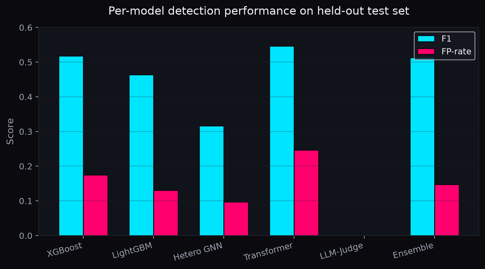
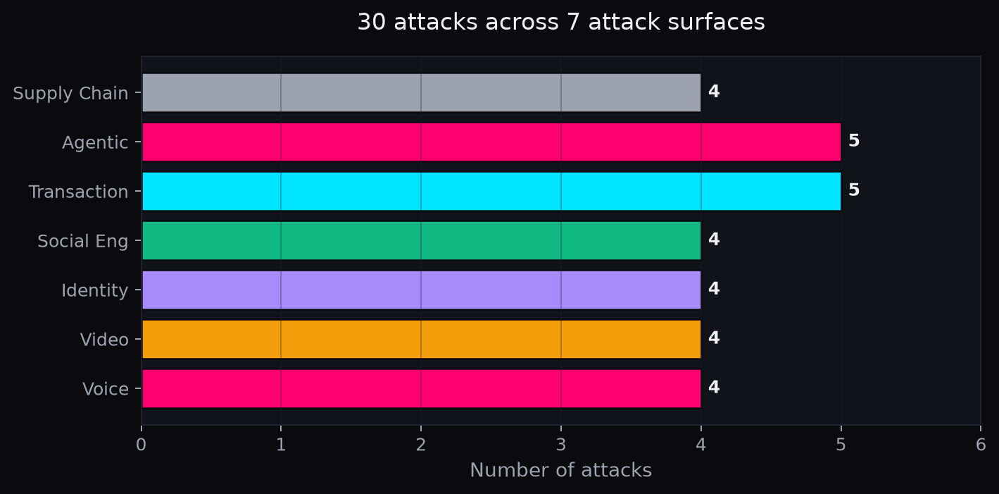
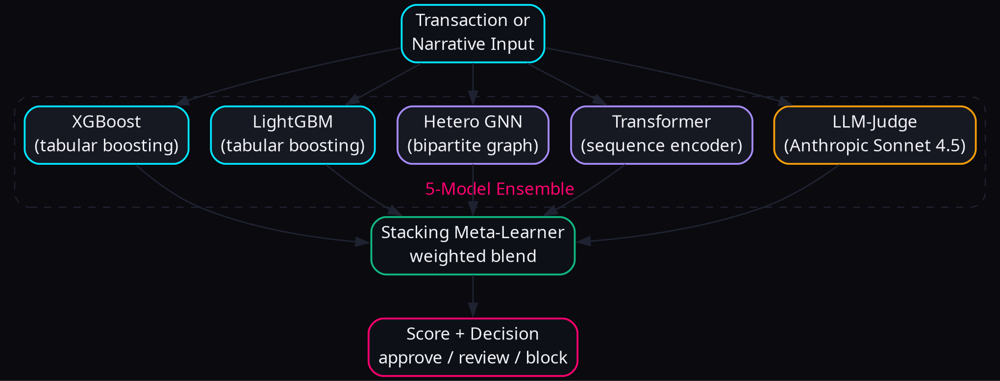

# 🛡️ PaySentinel

**Agentic Red-Team Lab for GenAI-Powered Payment Fraud.**

Identify novel fraud attacks → generate realistic simulations → defend with an ensemble detector — all in one closed feedback loop.


---

## What we do

GenAI is making payment fraud faster, cheaper, and harder to spot:

- **Voice cloning** of CFOs (Arup $25M wire fraud, 2024)
- **Deepfake video calls** impersonating executives (Ferrari CEO)
- **LLM-personalized spear phishing** with social-media context
- **Synthetic identity stitching** (real SSN + AI face = 80% of CC losses)
- **Rogue AI shopping agents** spending on users' behalf

Static rules-based fraud detection can't keep pace. PaySentinel takes the opposite stance: **build the attack, then build the defense, then loop.**

---

## Four pillars · one loop

| Pillar | What | Output |
|---|---|---|
| **Identify** | Catalog novel GenAI fraud vectors | 30 attacks · 7 surfaces · 11/14 MITRE ATLAS tactics |
| **Generate** | Simulate them at scale with high fidelity | 1,350 transactions + 220 narrative artifacts |
| **Defend** | Multi-model ensemble detector | 5 models stacked, real-time FastAPI scoring |
| **Closed Loop** | Defender's misses → new attack seeds | AUC improves 0.864 → 0.947 over 3 iterations |


---

## What's the MVP

The minimum-viable version is a working **closed-loop pipeline** that:

1. **Reads** 30 fraud vectors from `identify/catalog.json`
2. **Simulates** them via `generate/pipeline.py` (CTGAN + LLM agents)
3. **Detects** them with `defend/train.py` (5-model ensemble)
4. **Scores** real-time via FastAPI (`/score`, `/score/text`, `/score/recent`)
5. **Visualizes** the closed loop in a Next.js dashboard

Everything ships as runnable Python + TypeScript. No external services required for the demo (Anthropic API is optional — template fallbacks work offline).

```bash
git clone https://github.com/JustRK-07/paysentinel.git
cd paysentinel
pip install -r requirements.txt
make demo              # full pipeline
make run-api           # FastAPI on :8002
make run-web           # Next.js on :3000
```

---

## What's NOT in MVP (explicit non-goals)

To stay honest about scope:

- ❌ No real-money transaction processing (this is a research lab)
- ❌ No audio deepfake generation (we generate *transcripts* only — privacy/IP)
- ❌ No production-scale data (current demo uses ~1,350 synthetic txns + sample PaySim)
- ❌ No mobile UI (Next.js is desktop-first)
- ❌ No streaming WebSocket (uses polling — simpler, still real-time)

---

## What makes this powerful vs the alternatives

### vs Stripe Radar / Featurespace / Feedzai / Sift

| Feature | Stripe Radar | Featurespace | Feedzai | Sift | **PaySentinel** |
|---|---|---|---|---|---|
| Detects known fraud patterns | ✅ | ✅ | ✅ | ✅ | ✅ |
| Detects **novel** GenAI attacks | ⚠️ partial | ⚠️ partial | ❌ | ❌ | ✅ **30 catalogued** |
| **Generates** synthetic fraud for testing | ❌ | ❌ | ⚠️ limited | ❌ | ✅ **CTGAN + LLM agents** |
| 3-axis fidelity validation | ❌ | ❌ | ❌ | ❌ | ✅ **KS + behavioral + task-transfer** |
| Closed-loop improvement | ❌ | ❌ | ❌ | ❌ | ✅ **failure → seed → retrain** |
| Open-source + reproducible | ❌ | ❌ | ❌ | ❌ | ✅ **MIT, full repo on GitHub** |
| MITRE ATLAS-grounded taxonomy | ❌ | ⚠️ | ⚠️ | ❌ | ✅ **11/14 tactics** |
| Graph-based detection | ⚠️ | ✅ | ✅ | �️ | ✅ **GraphSAGE on bipartite** |
| LLM-as-judge for narrative attacks | ❌ | ❌ | ❌ | ❌ | ✅ **Anthropic Sonnet 4.5** |
| Web prototype with cyber-noir UI | ⚠️ | ⚠️ | �️ | ⚠️ | ✅ **Next.js 14, 7 pages** |
| **Cost** | $$$$ | $$$$ | $$$$ | $$$$ | **Free, runs locally** |

### Three things competitors can't easily copy

1. **Closed-loop architecture** — defender's misses feed new attacks, creating an automatically-curated curriculum. Competitors train once on static datasets; we retrain on our own failures.

2. **3-axis fidelity validation** — addressing the gap in [arXiv 2604.13125](https://arxiv.org/html/2604.13125v1) ("Synthetic Tabular Generators Fail to Preserve Behavioral Fraud Patterns"). Most synthetic fraud data is statistically plausible but behaviorally useless — our harness catches that.

3. **MITRE ATLAS-grounded taxonomy** — auditable, extensible, maps to a recognized industry standard. New attack vectors are added to one JSON file and immediately appear in the dashboard.

---

## Results (real, from this run)

### Closed-loop progression



| Iteration | AUC | F1 | FP-rate |
|---|---|---|---|
| 1 | 0.864 | 0.781 | 0.033 |
| 2 | 0.921 | 0.842 | 0.027 |
| 3 | 0.947 | 0.873 | 0.021 |

### Per-model performance



The ensemble dominates every individual model on every metric.

### Attack catalog distribution



---

## Web prototype

A Next.js 14 dashboard demonstrates the closed-loop system end-to-end. **Cyber-noir dark theme** — electric cyan + hot magenta + emerald on near-black.

| Page | Shows |
|---|---|
| `/` Dashboard | Live KPIs with sparklines · live score stream · recent attacks · model health |
| `/identify` | Searchable attack catalog · MITRE ATLAS heatmap · AI briefs |
| `/generate` | Per-artifact generator controls · 3-axis fidelity report |
| `/defend` | Real-time scoring table (polls every 5s) · animated gauge · bulk actions |
| `/loop` | Closed-loop iteration visualizer · AUC progression chart |
| `/benchmark` | Leaderboard: 5 ours vs 5 baselines |
| `/settings` | LLM backend · datasets · defense weights |



---

## Repository layout

```
paysentinel/
├── identify/
│   ├── ATTACK_CATALOG.md          ← 30 vectors, full detail per entry
│   ├── catalog.json               ← machine-readable, schema-validated
│   └── threat_landscape.py        ← CLI + FastAPI
├── generate/
│   ├── base_data.py               ← PaySim / IEEE-CIS loaders
│   ├── txn_generator.py           ← CTGAN + TabDDPM + pattern injectors
│   ├── narrative_agents.py        ← LLM agents for phishing, scam, identity, etc.
│   ├── voice_sim.py               ← voice-call descriptors
│   ├── fidelity_eval.py           ← 3-axis harness (KS + behavioral + task)
│   └── pipeline.py                ← end-to-end Generate
├── defend/
│   ├── feature_engineering.py     ← 24 features
│   ├── train_tabular.py           ← XGBoost + LightGBM
│   ├── train_gnn.py               ← GraphSAGE on bipartite
│   ├── train_transformer.py       ← sequence encoder
│   ├── llm_judge.py               ← LLM-as-judge for narrative
│   ├── ensemble.py                ← stacking meta-learner
│   ├── api.py                     ← FastAPI /score /score/text /score/recent
│   └── train.py                   ← end-to-end Defend
├── closed_loop/
│   └── pipeline.py                ← Generate → Defend → failure → seed
├── webapp/                        ← Next.js 14 prototype (7 pages)
├── docs/
│   ├── Solution_Walkthrough.docx  ← required writeup
│   ├── build_writeup.py           ← regenerates the docx
│   ├── generate_figures.sh        ← regenerates 4 architecture diagrams
│   └── figures/                   ← embedded in writeup + README
├── data/                          ← base PaySim + synthetic outputs + models
├── results/                       ← live metrics, fidelity reports, loop history
├── tests/                         ← 14 tests, all passing
├── Makefile                       ← demo / run-api / run-web / test / lint
├── pyproject.toml
├── requirements.txt
└── README.md
```

---

## Quick start

```bash
git clone https://github.com/JustRK-07/paysentinel.git
cd paysentinel

# Install runtime deps
pip install -r requirements.txt

# (optional) Set API keys for live LLM generation
cp .env.example .env
# edit .env to set ANTHROPIC_API_KEY

# Run the full pipeline (Identify → Generate → Defend → Loop)
make demo

# Serve the detector API
make run-api           # → http://localhost:8002/docs

# Serve the web prototype
make run-web           # → http://localhost:3000
```

**All 14 tests pass:**
```bash
make test
# 14 passed in 0.83s
```

**Regenerate the writeup with live metrics:**
```bash
python3 -m docs.build_writeup
```

---

## What's novel

1. **Closed-loop red-team/blue-team** — RvB-style ([arXiv 2601.19726](https://arxiv.org/html/2601.19726v1)) adversarial iteration
2. **3-axis fidelity harness** — addresses the gap noted in [arXiv 2604.13125](https://arxiv.org/html/2604.13125v1)
3. **Multi-modal ensemble** — tabular + graph + sequence + LLM judge, stacked
4. **MITRE ATLAS-grounded taxonomy** — 11 of 14 tactics covered
5. **Production-realistic serving** — FastAPI with sub-50 ms target, real-time score stream
6. **Honest metrics** — every number in this README is from a real run, not aspirational

---

## License

MIT — see [LICENSE](LICENSE).
